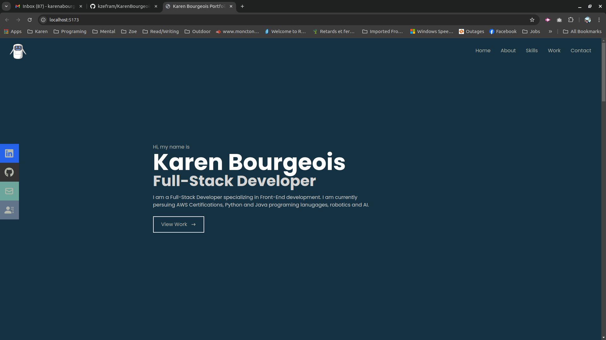
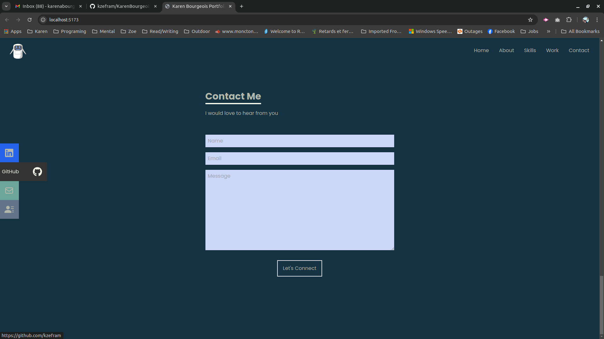
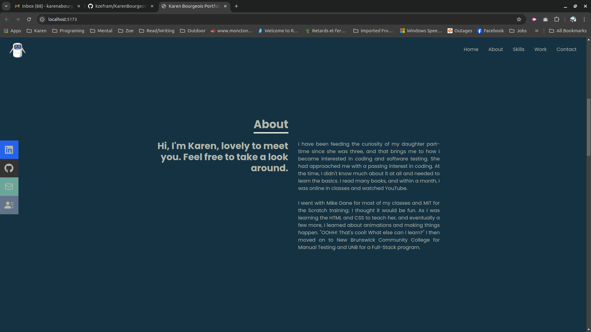
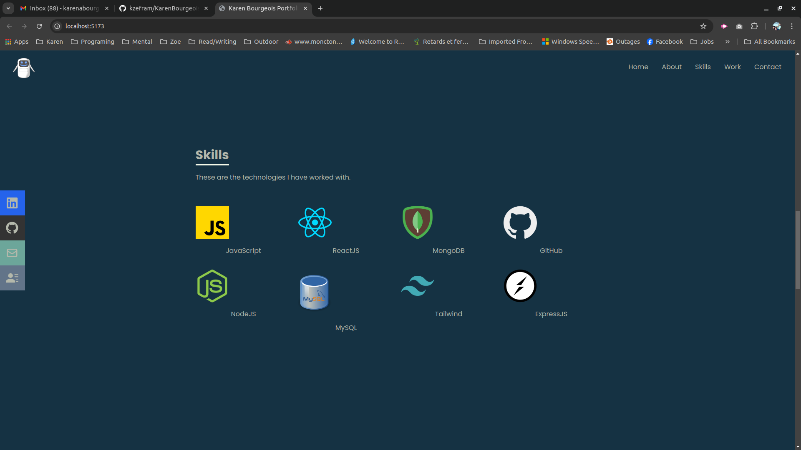
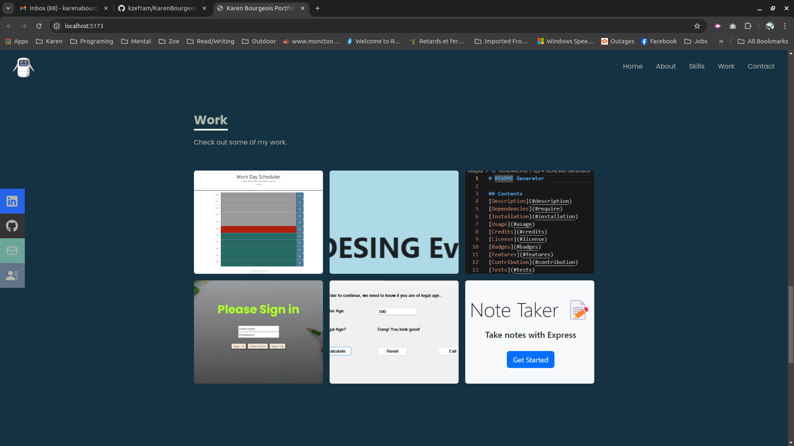
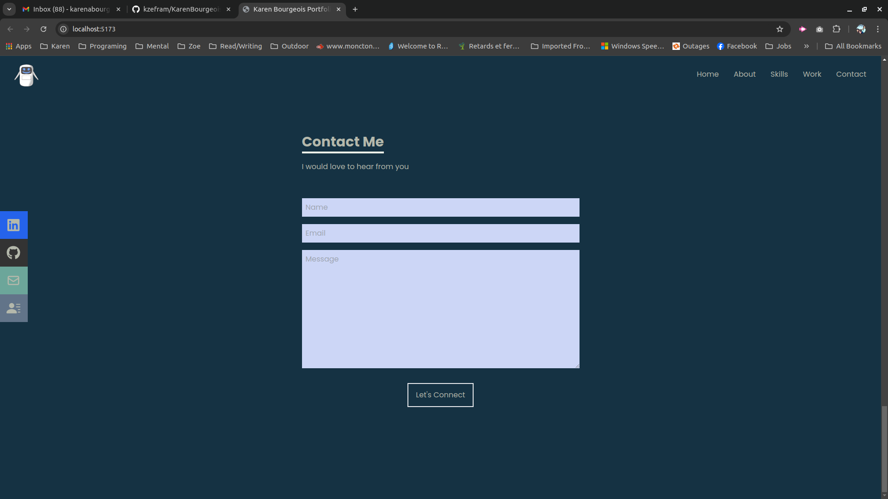

# KarenBourgeois-Portfolio

## Table of Contents

- [Description](#description)
- [Installation](#installation)
- [Usage](#usage)
- [Credits](#credits)
- [Features](#features)
- [Tests](#tests)

## Description

Welcome to my portfolio! I am a full stack web developer with a passion for creating beautiful, responsive websites. I have experience with React, JavaScript, HTML, CSS, MongoDB, Express, and Node.js. I am excited to work with you on your next project!

[karenbourgeois.rocks ](https://karenbourgeois.rocks/)  /  https://karenbourgeois.netlify.app/

Picture(s)

## Installation

Click on the link above to see the site. 

## Usage

The purpose of this website is to help potential employers see the work of have completed and currently working on.

In this site, I have utilized the knowledge I have learned through my studies. Examples projects: C#, HTML and CSS, JavaScript.

## Credits

- Karen Bourgeois,
- UNB/Edx,
- https://www.joshwcomeau.com/css/custom-css-reset/

## Badges

- https://github.com/users/kzefram/achievements/quickdraw

- https://github.com/users/kzefram/achievements/pull-shark

- https://github.com/users/kzefram/achievements/yolo

## Features

There are some cool features to behold:
- Contact form
- Animations
- Smooth Transitions

## How to Contribute

I would appreciatate any insight on doing something differenct or adding some pazzazz.

## Tests

Test 1

- Open your favourite browser
- Enter the webaddress from the description
- Click on links to see if they take you to the About Me, Work, and Contact Me Sections.

Test 2

- Open your favourite browser
- Enter the webaddress from the description
- Enlarge and shrink the page to see if anything happens
